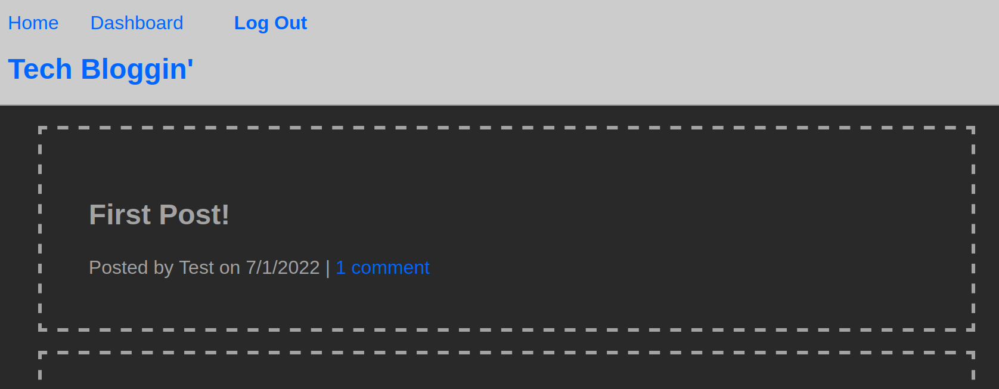

# Tech Blog

## Description
A blogging site that allows users to make posts and comment on others' posts. 


## Technologies
This is a Node.js-based app that uses Express.js, the Handlebars templating engine, a MySQL database, and the Sequelize ORM tool. 

## Installation
After downloading, run
```bash
npm i
```
to install dependencies. 
## Usage
### Local Host
Start a local server by entering 
```bash
node server
```
After executing the default commands, you should see the message:
```bash
Now listening
```
### Heroku app
The live heroku app can be accessed here: 
[Heroku App](https://ucb14-tech-blog.herokuapp.com/)
